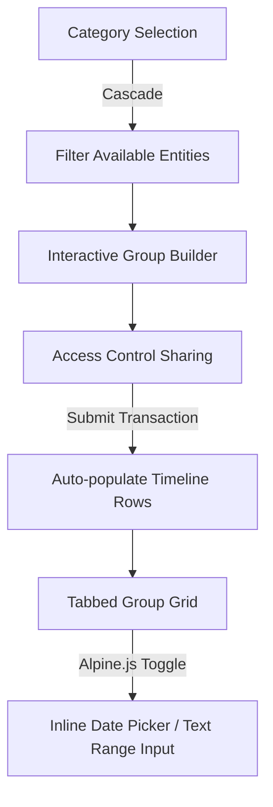

# Cascading Wizard & Inline Timeline Grid Pattern

This document describes the design, database layout, and frontend architecture of the **Cascading Wizard & Inline Timeline Grid Pattern**—a premium flow for grouping items, setting up templates, sharing access control, and managing chronological sheets inline.

---

## 1. Architectural Overview

This pattern is designed to replace heavy multi-page forms or cluttered nested modals with a clean, fluid three-step creation wizard followed by a tabbed inline-editing grid.



### Key Elements:
1. **Cascading Filter**: Selection of a parent/category dynamically updates the list of available items (e.g., selecting a course filters students).
2. **Step-by-step Creation Wizard**: Multi-step configuration (Metadata → Interactive Group Builder → Shared Access Permissions) managed cleanly via Alpine.js local state.
3. **Template Auto-population**: Dynamic runtime parsing of markdown templates (`.md` files) to populate default timeline spreadsheets upon group creation.
4. **Inline Grid CRUD**: A tabbed list displaying child rows for each group, supporting inline Add, Edit, and Delete actions without full-page reloads.
5. **Dual-Mode Date Selector**: Support for standard calendar date inputs and custom range strings (e.g., "February 18–25, 2026") using Alpine-driven field toggles.

---

## 2. Database Schema Blueprint

Implement the following database schema representing the relationship layers:

```
[Category/Root] 
       └── [Parent Container] (e.g., Section)
                 ├── [Shared Access Control] (Pivot to Users)
                 └── [Groupings] (e.g., Groups)
                           ├── [Group Members] (Pivot to Secondary Entities/Users)
                           └── [Chronological Rows] (e.g., Timeline Events)
```

```php
// Migration 1: Parent Container
Schema::create('parent_containers', function (Blueprint $table) {
    $table->id();
    $table->string('title', 150);
    $table->foreignId('category_id')->constrained('categories')->restrictOnDelete();
    $table->foreignId('created_by')->constrained('users')->cascadeOnDelete();
    $table->timestamps();
});

// Migration 2: Groupings
Schema::create('container_groups', function (Blueprint $table) {
    $table->id();
    $table->foreignId('container_id')->constrained('parent_containers')->cascadeOnDelete();
    $table->unsignedSmallInteger('position'); // Display order (1, 2, 3...)
    $table->timestamps();
});

// Migration 3: Group Members (Many-to-Many)
Schema::create('group_members', function (Blueprint $table) {
    $table->id();
    $table->foreignId('group_id')->constrained('container_groups')->cascadeOnDelete();
    $table->foreignId('entity_id')->constrained('entities')->restrictOnDelete();
    $table->timestamps();
});

// Migration 4: Shared Access Control (Pivot)
Schema::create('container_managers', function (Blueprint $table) {
    $table->id();
    $table->foreignId('container_id')->constrained('parent_containers')->cascadeOnDelete();
    $table->foreignId('user_id')->constrained('users')->cascadeOnDelete();
    $table->timestamps();
    $table->unique(['container_id', 'user_id']);
});

// Migration 5: Chronological Rows (Varchar Date Support)
Schema::create('grid_rows', function (Blueprint $table) {
    $table->id();
    $table->foreignId('group_id')->constrained('container_groups')->cascadeOnDelete();
    $table->string('date', 100); // Varchar to store strings like "February 18–25, 2026"
    $table->text('details')->nullable();
    $table->string('status', 100)->nullable();
    $table->string('remarks', 191)->nullable();
    $table->timestamps();
});
```

---

## 3. Dynamic Template Parser

To avoid hardcoding template rows or relying on seeders, read and parse a markdown table at runtime. 

### Model Accessor & Casts:
In the `GridRow` model, remove the default `date` cast to allow raw text strings. Add a custom `formatted_date` attribute to parse standard `YYYY-MM-DD` dates for readable displays while outputting range strings as-is:

```php
// app/Models/GridRow.php
class GridRow extends Model
{
    protected $fillable = ['group_id', 'date', 'details', 'status', 'remarks'];

    protected $casts = []; // No date cast

    public function getFormattedDateAttribute(): string
    {
        // If YYYY-MM-DD, format it. Otherwise, return raw string
        if (preg_match('/^\d{4}-\d{2}-\d{2}$/', $this->date)) {
            return \Carbon\Carbon::parse($this->date)->format('M d, Y');
        }
        return $this->date;
    }
}
```

### Parser Implementation:
In the `ContainerGroup` model, implement the dynamic parsing logic:

```php
// app/Models/ContainerGroup.php
public function createDefaultTimelineRows(): void
{
    $filePath = base_path('template_timeline.md');
    if (! file_exists($filePath)) {
        return;
    }

    $content = file_get_contents($filePath);
    $lines = explode("\n", $content);

    foreach ($lines as $line) {
        $line = trim($line);
        
        // Match table rows
        if (str_starts_with($line, '|')) {
            // Skip header and dividers
            if (str_contains($line, 'Date') || str_contains($line, '---')) {
                continue;
            }

            $cols = explode('|', $line);
            if (count($cols) >= 4) {
                $date = trim($cols[1]);
                $details = trim($cols[2]);

                // Normalize HTML br tags to standard newlines
                $details = str_replace(['<br>', '<br/>', '<br />'], "\n", $details);

                $this->rows()->create([
                    'date'    => $date,
                    'details' => $details,
                    'status'  => null,
                    'remarks' => null,
                ]);
            }
        }
    }
}
```

---

## 4. Frontend Wizard & Cascade

Manage form progression, AJAX filters, and list assignments in a unified Alpine.js state object inside `create.blade.php`.

### JavaScript / Alpine.js Wizard Controller:
```javascript
function wizardController() {
    return {
        step: 1,
        categoryId: '',
        entitiesList: [], // Loaded via AJAX
        pendingMembers: [],
        groups: [],
        managers: [],

        // Step 1: Cascade Filter
        async fetchEntities() {
            if (!this.categoryId) return;
            const res = await fetch(`/api/entities?category_id=${this.categoryId}`);
            this.entitiesList = await res.json();
        },

        // Step 2: Interactive Grouping
        addToPending(entity) {
            this.pendingMembers.push(entity);
            this.entitiesList = this.entitiesList.filter(e => e.id !== entity.id);
        },
        commitGroup() {
            if (this.pendingMembers.length === 0) return;
            this.groups.push({
                members: [...this.pendingMembers]
            });
            this.pendingMembers = [];
        },

        // Step 3: Submission payload
        submitForm(e) {
            // Inject groups and managers as JSON input fields before posting
            this.$refs.groupsInput.value = JSON.stringify(this.groups.map(g => ({
                members: g.members.map(m => m.id)
            })));
            this.$refs.managersInput.value = JSON.stringify(this.managers.map(m => m.id));
            e.target.submit();
        }
    };
}
```

---

## 5. Inline Timeline Grid

The detail view switches groups via tabs, showing an inline grid where rows are edited or deleted on the fly using local Alpine scopes inside a `<tr>`.

### Blade Table Structure (`show.blade.php`):
```html
<table class="w-full table-fixed text-sm">
    <thead>
        <tr class="bg-gray-50 border-b">
            <th class="w-[20%] text-left px-4 py-2">Date</th>
            <th class="w-[50%] text-left px-4 py-2">Details</th>
            <th class="w-[15%] text-left px-4 py-2">Status</th>
            <th class="w-[15%]"></th>
        </tr>
    </thead>
    <tbody>
        {{-- Existing Rows --}}
        @foreach($group->rows as $row)
            <tr x-data="{ 
                editing: false, 
                date: {{ json_encode($row->date) }}, 
                customDate: !(/^\d{4}-\d{2}-\d{2}$/.test({{ json_encode($row->date) }})), 
                details: {{ json_encode($row->details) }} 
            }" class="border-b hover:bg-gray-50">
                
                {{-- VIEW MODE --}}
                <td x-show="!editing" class="px-4 py-3">{{ $row->formatted_date }}</td>
                <td x-show="!editing" class="px-4 py-3 whitespace-pre-line">{{ $row->details }}</td>
                <td x-show="!editing" class="px-4 py-3">{{ $row->status }}</td>
                <td x-show="!editing" class="px-4 py-3 text-right">
                    <button type="button" @click="editing = true">Edit</button>
                </td>

                {{-- EDIT MODE --}}
                <td colspan="4" x-show="editing" x-cloak class="px-4 py-3">
                    <form method="POST" action="{{ route('rows.update', $row) }}" class="flex gap-4">
                        @csrf @method('PUT')
                        
                        {{-- Dual-Mode Date Selector --}}
                        <div class="w-1/3">
                            <div class="flex items-center justify-between text-xs mb-1">
                                <label>Date</label>
                                <button type="button" @click="customDate = !customDate" class="underline text-blue-600">
                                    <span x-show="!customDate">Custom Text</span>
                                    <span x-show="customDate" x-cloak>Calendar</span>
                                </button>
                            </div>
                            <template x-if="!customDate">
                                <input type="date" name="date" x-model="date" required class="w-full text-xs" />
                            </template>
                            <template x-if="customDate">
                                <input type="text" name="date" x-model="date" placeholder="e.g. February 18–25, 2026" required class="w-full text-xs" />
                            </template>
                        </div>

                        <div class="w-1/2">
                            <textarea name="details" x-model="details" class="w-full text-xs"></textarea>
                        </div>

                        <div class="flex gap-2 items-center">
                            <button type="button" @click="editing = false">Cancel</button>
                            <button type="submit">Save</button>
                        </div>
                    </form>
                </td>
            </tr>
        @endforeach
    </tbody>
</table>
```

---

## 6. Access Control & Gate Rules

Apply multi-user editing privileges in route middleware or form requests.

1. **Owner vs Manager**: The container creator (`created_by`) has destructive actions (Delete Section).
2. **Shared Access**: Users with shared permissions (`container_managers` pivot) have full edit permissions on the child row sheets, but cannot delete the parent container.
3. **Middleware Rule**: Encapsulate permission checks in an Eloquent model scope or helper:
   ```php
   // app/Models/ParentContainer.php
   public function isAccessibleBy(int $userId): bool
   {
       if ($this->created_by === $userId) {
           return true;
       }
       return $this->sharedManagers()->where('user_id', $userId)->exists();
   }
   ```
